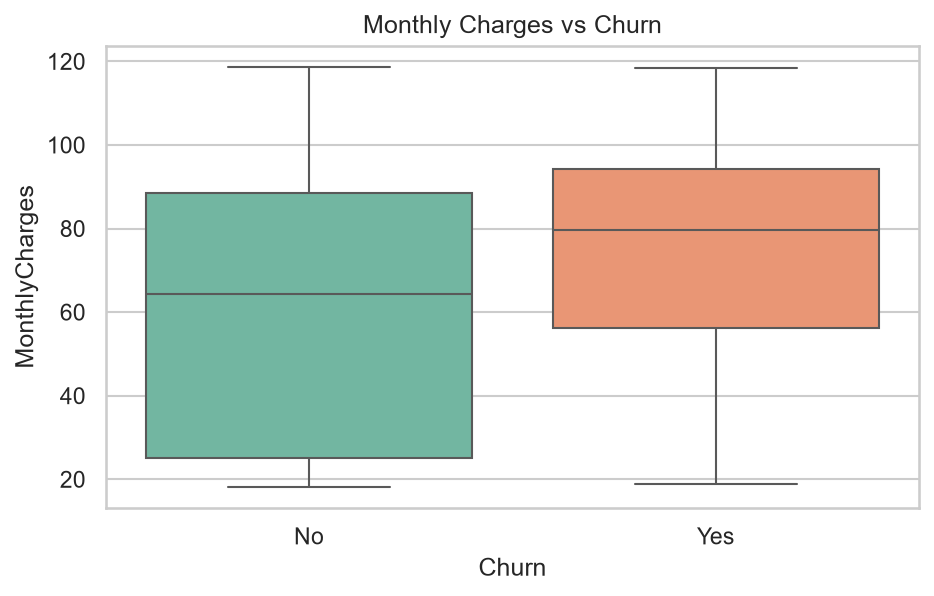

# Telco Customer Churn Analysis

## Overview

I analyzed a telecom company's customer data to understand why customers churn is happening, 

which groups are most at risk and built a logistic regression model to predict churn.

## Dataset

The dataset (`WA\_Fn-UseC\_-Telco-Customer-Churn.csv`) is included in this repo.

**Original source:** https://www.kaggle.com/datasets/blastchar/telco-customer-churn

## Tools & Libraries Used

- Python

- pandas

- matplotlib / seaborn

- scikit-learn

- Jupyter Notebook

## Key Insights

- About 26% of customers churned — roughly 1 in 4

- Month-to-month contract customers churn far more than those on annual or two-year plans

- Most churn happens within the first 12 months — the first year is the highest-risk period

- Churners pay higher monthly charges on average, suggesting a value perception problem

- Fiber optic users churn more than DSL users, likely due to higher costs and no contract lock-in

- The logistic regression model achieved ~80% accuracy in predicting churn

## Visualizations

## How to Run

1. Clone this repository

2. Open `telcoanalysis.ipynb` in Jupyter Notebook

3. Run all cells

## Author

Shivalika Katoch

[LinkedIn](https://www.linkedin.com/in/shivalika-katoch-da)

[GitHub](https://github.com/shivalikakatoch01-design)

